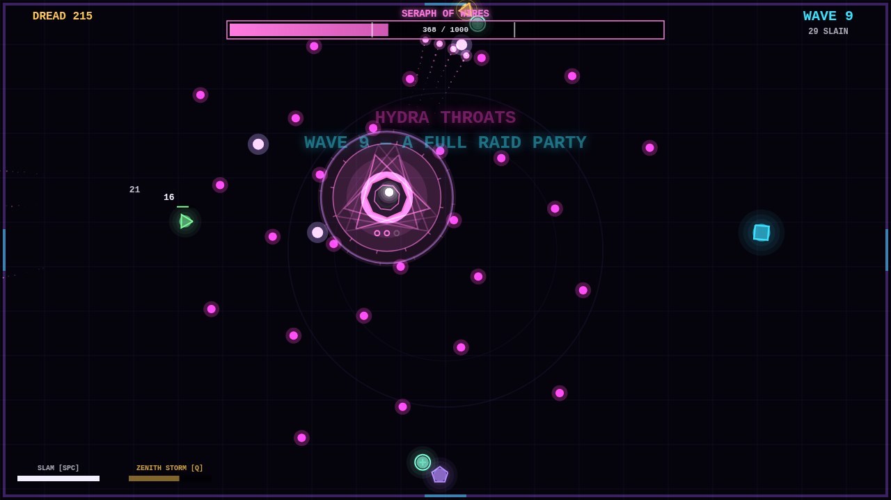
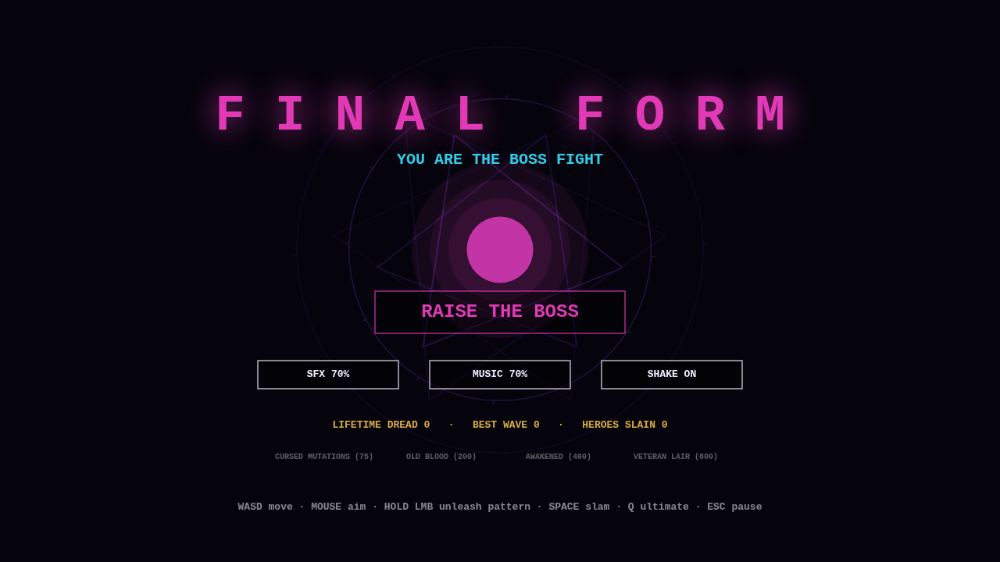
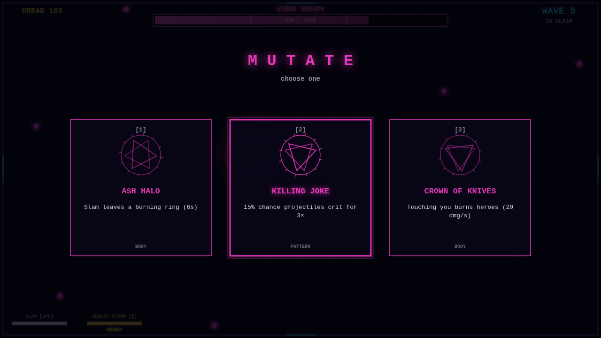
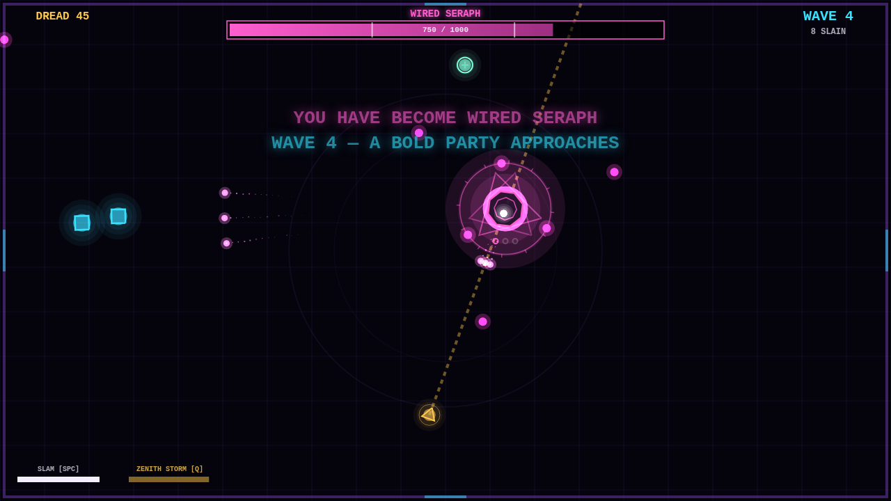
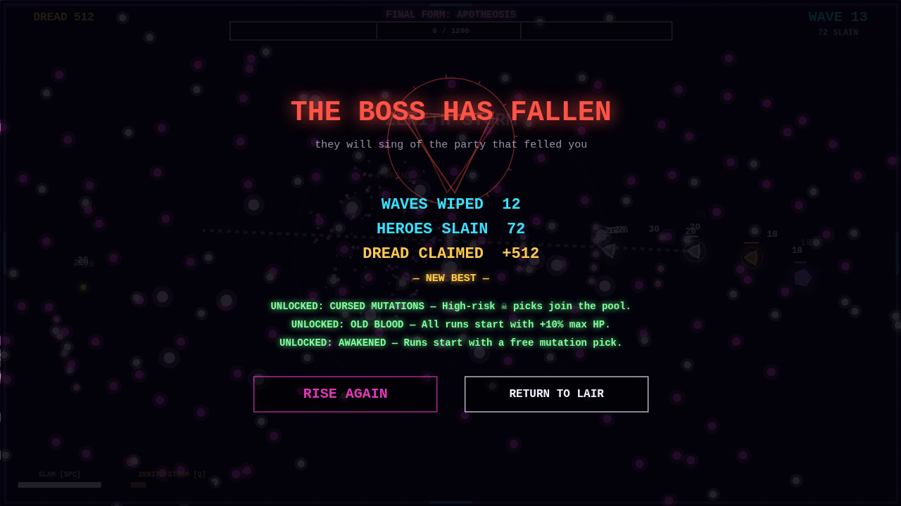

# FINAL FORM — You Are The Boss Fight

> Every game made you kill the final boss.
> This one lets you **be** the final boss.

A reverse boss-fight roguelite. Waves of heroes raid your lair — Knights
block, Rogues dodge-roll, Archers kite, Mages drop AoEs on your head, and
Healers ruin everything. You are the raid encounter: unleash bullet-hell
patterns, wipe the party, pick a mutation, and evolve into your FINAL FORM.



## Features

- **5 hero archetypes + named Paladin mini-bosses** with real "player
  character" AI: shields, dodge rolls, kiting, focus healing, potion chugs
- **Boss enrage phases** at 66% / 33% HP — losing health makes you stronger
- **21 mutations** (pattern / body / lair / cursed) picked after every wave
- **Evolution tree**: Husk → Seraph or Grave Tide branches at waves 3/6/9,
  each with its own patterns, ultimate, and look
- **Meta progression**: lifetime Dread unlocks cursed picks and permanent power
- **8 achievements**, Steam-ready via the Electron + Steamworks wrapper
- Procedural occult-synthwave art and synthesized audio — zero licensed assets

## Controls

WASD move · mouse aim · **hold LMB** unleash pattern · **Space** slam ·
**Q** ultimate (when charged) · Esc pause

## Run it

```sh
npx http-server web -p 8123     # any static server works
# open http://localhost:8123
```

Desktop (Steam) build: see [`desktop/`](desktop) and
[`docs/STEAM_SHIPPING.md`](docs/STEAM_SHIPPING.md).

## Screenshots

| | |
|---|---|
|  |  |
|  |  |

## Repo layout

- `web/` — the game (vanilla JS + canvas, native ES modules, no build step)
- `desktop/` — Electron wrapper + Steamworks achievement bridge
- `tests/` — Playwright QA: smoke test, autopilot balance runs, screen captures
- `docs/` — game design doc, dev plan, **Steam shipping checklist**

## QA

The game is tested end-to-end with Playwright driving real Chromium:
deterministic seeds (`?seed=`), an autopilot bot (`?auto=1`), timescale
(`?fast=`), and `[PLAYTEST]` balance telemetry. See [`tests/`](tests).
